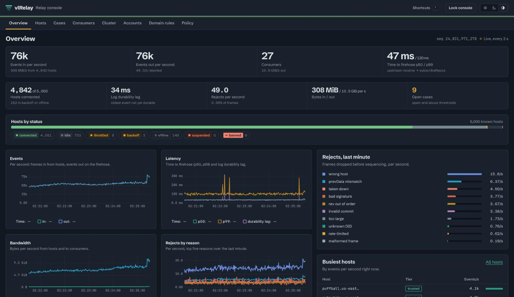

# vlRelay

vlRelay is an atproto relay whose only durable state is an object store. It subscribes to PDSes,
checks every event against sync 1.1, and serves one combined firehose from as many nodes as you
run, all on one S3, R2, GCS or MinIO bucket.



It's built from the parts of [vlpds](https://github.com/jazware/vlpds) that worked: its log, leases, firehose merger,
SlateDB state and peer TLS. Consumers see a normal relay. indigo's Go consumers, `goat` and
Jetstream read it unchanged.

## Highlights

- The bucket is the only durable state. Events are group-committed into log segments with
  conditional PUTs, and per-account sync state lives in SlateDB on the same bucket. A node keeps
  nothing on local disk, so losing one only costs you its caches. → [Design](docs/design.html)
- Nodes share the work with no coordinator. Host shards decide which node subscribes to which
  PDS, and DID shards decide which node keeps each account's state. Every core node merges every
  log into the same stream with the same seqs, so a consumer can resume on any node with its
  cursor. A crashed node's shards move in ~1-2 s when its peer port refuses connections (lease
  TTL plus a fifth of it when it hangs), and a SIGTERM hands them over in under a second.
  → [Cluster](docs/cluster.md)
- Edges and replicas add egress without adding ingest. An edge follows the cores' logs over
  mTLS, and a replica follows them from the bucket with nothing but read access.
- Every event is checked. vlRelay verifies commit signatures, the MST inversion against
  `prevData`, rev order and host authority, and keeps per-account chain state. Signature
  verification is ~33 µs of CPU per event, so one core checks ~30k events/s.
- One 8-core node sustains ~94k events/s with every event checked, p99 time to firehose under
  0.7 s and 0 rejects (measured on MinIO, ~2.8x the 33k/s per-node design target).
  → [Performance](docs/perf.md)
- Policy is data in the bucket. Host tiers, per-host and per-account limits, domain rules,
  requestCrawl admission, cluster-wide budgets, auto-throttling and spam counters that open cases
  are one versioned document that every node reloads. The defaults follow indigo's relay wherever it
  has a number.
  → [Policy](docs/policy.md)
- The operator dashboard at `/admin` shows live rates, rejects, hosts, consumers, cases and the
  cluster, and edits the policy and domain rules, throttles or bans hosts, and takes down
  accounts. → [Admin API](docs/admin-api.md)
- It's compatible with what reads Bluesky's relay today. indigo's consumer, the sync 1.1 checks,
  `goat`, Jetstream and the sync API matched indigo's relay event for event on the same upstreams.
  The exception is `@atproto/sync`, which rejects seqs above 2^53 (vlRelay's are ~4.6e17).
  → [Compatibility](docs/compat.md)

Archival mode (a full mirror of every repo, for getRepo) is designed but still in progress.

## Quickstart

With Docker and [just](https://github.com/casey/just), from `vlrelay`:

```sh
just docker-build        # builds vlrelay:local (the context is packages/, it needs ../vlpds)
docker run --rm -p 2980:2980 vlrelay:local \
  --memory --host morel.us-east.host.bsky.network --admin-token dev
```

That's one node, in memory, subscribed to one of Bluesky's PDSes. The firehose is
`ws://127.0.0.1:2980/xrpc/com.atproto.sync.subscribeRepos` and the dashboard is
<http://127.0.0.1:2980/admin> (user `admin`, password `dev`).

`--memory` keeps nothing. [`deploy/single`](deploy/single/docker-compose.yml) runs a node on a
local MinIO, and [`deploy/cluster`](deploy/cluster/docker-compose.yml) runs three cores with peer
mTLS. [Deploy](docs/operations/deploy.md) walks through both.

To work on it, `just dev-up` starts a local network (MinIO, PLC, the reference PDS and two vlpds
upstreams), `just dev-seed` and `just dev-load` put accounts and traffic on it, and `just relay`
runs the relay against it. [Dev loop](docs/devloop.md) has the rest.

## Documentation

[docs/index.md](docs/index.md) puts the pages in reading order.

| Start here | Run it | How it works |
|---|---|---|
| [Design](docs/design.html) | [Deploy](docs/operations/deploy.md) | [Cluster](docs/cluster.md) |
| [Build plan](docs/PLAN.md) | [Configuration](docs/operations/configuration.md) | [Policy](docs/policy.md) |
| [Dev loop](docs/devloop.md) | [Monitoring](docs/operations/monitoring.md) | [Performance](docs/perf.md) |
| [Load fleet](docs/loadfleet.md) | [Admin API](docs/admin-api.md) | [Compatibility](docs/compat.md) |
| | | [Reference notes](docs/reference-notes.md) |

## Status

vlRelay is new and hasn't run in production. It has unit and differential tests against a second
atproto implementation, an e2e suite on a local network (single node, cluster with kill -9 and
SIGTERM, policy faults) and the compat harness against indigo's tools. The docs list what's not
built yet in each area.

## License

MIT
