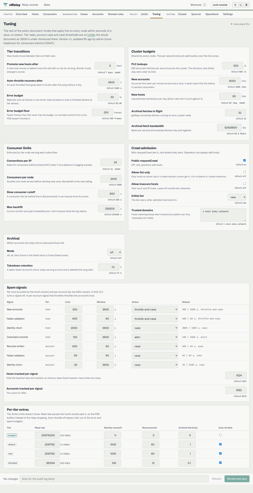

# vlRelay

vlRelay is an atproto relay on a replicated log. It subscribes to PDSes, checks every event
against sync 1.1, and serves one combined firehose from one node or three, with an S3, R2, GCS or
MinIO bucket as its long-term copy.


It's built from the parts of [vlpds](https://github.com/jazware/vlpds) that worked: its log segments, firehose serving and
SlateDB state. Consumers see a normal relay. indigo's Go consumers, `goat` and Jetstream read it
unchanged.

## Highlights

- Every node is a member of one quorum log. Each node reads the PDSes the leader's host table
  gives it and verifies their events. The leader checks each event against the account's record,
  gives it the next seq and replicates it, and every node emits it once two of the three hold it
  on disk. So a consumer can resume on any node with its cursor, and a takeover never takes back
  an event a consumer saw. → [Cluster](docs/cluster.md)
- A dead leader is replaced in ~50-120 ms (kill -9), or ~1 s when it hangs or is cut off. A dead
  member's PDSes move to the others after 2 s and resume from their cursors, which ride in the log.
- The bucket is written in bulk. Every 30 s the leader flushes the log as 64 MiB segments, the
  accounts' records, the host table and the PDS cursors, with one manifest written last. That's
  about 0.5 writes and 1.7 reads a second at today's load. If two nodes lose their disks, the log
  resumes from the last flush and the PDSes resend the rest. → [Design](docs/design.md)
- One node is the same log with one member, its commitlog the write-ahead log. Going to three is a
  membership change (`qlog member` or the dashboard), with no migration.
- Every event is checked. vlRelay verifies commit signatures, the MST inversion against
  `prevData`, rev order and host authority, and keeps per-account chain state. Signature
  verification is ~33 µs of CPU per event, so one core checks ~30k events/s.
- The quorum log commits 200k events/s on three nodes with their commitlogs on tmpfs (measured),
  and at today's ~350 events/s three small VPSes and R2 come to ~$19 a month (modeled).
  → [Performance](docs/perf.md), [Cost](docs/cost.md)
- Policy is data in the bucket. Host tiers, per-host and per-account limits, domain rules,
  requestCrawl admission, cluster-wide budgets, auto-throttling and spam counters that open cases
  are one versioned document that every node reloads. The defaults follow indigo's relay wherever it
  has a number.
  → [Policy](docs/policy.md)
- A public page at `/` shows safe aggregates (events/s, time to firehose, hosts, consumers, node
  and quorum health) and how to subscribe, from an allow-listed `/api/public/stats`. The operator
  console at `/admin` shows live rates, rejects, hosts, consumers, cases, the cluster, the quorum
  log and the effective config, and edits the policy (limits and live tuning) and domain rules,
  throttles or bans hosts, and takes down accounts. → [Admin API](docs/admin-api.md)
- It's compatible with what reads Bluesky's relay today. indigo's consumer, the sync 1.1 checks,
  `goat`, `@atproto/sync`, Jetstream and the sync API matched indigo's relay event for event on the
  same upstreams, and the seqs are dense (1, 2, 3, …) and the same on every node.
  → [Compatibility](docs/compat.md), [Subscribe to the firehose](docs/subscribing.md)

The overview at the top is real traffic, from the [shadow run](docs/shadow.md) against ten PDSes.
The demo backend's simulated 5,000-host relay shows the busy end of the hosts page:


The public page, on the demo backend:


The console's quorum log page, with each member's acked, committed and emitted seq, the flush
point F and reserve R, membership changes and bucket recoveries:


Tuning edits the live half of the policy document (transitions, cluster budgets, consumer limits,
crawl admission, spam signals) against each field's default:



## Quickstart

With Docker and [just](https://github.com/casey/just), from `vlrelay`:

```sh
just docker-build        # builds vlrelay:local (the context is packages/, it needs ../vlpds)
docker run --rm -p 2980:2980 vlrelay:local \
  --memory --host morel.us-east.host.bsky.network --admin-token dev
```

That's one node, in memory, subscribed to one of Bluesky's PDSes. The firehose is
`ws://127.0.0.1:2980/xrpc/com.atproto.sync.subscribeRepos` and the dashboard is
<http://127.0.0.1:2980/admin> (user `admin`, password `dev`).

`--memory` keeps nothing. [`deploy/single`](deploy/single/docker-compose.yml) runs a node on a
local MinIO. [Cluster](docs/cluster.md#running-one) has the flags for three nodes, and
[Deploy](docs/operations/deploy.md) walks through running it.

To work on it, `just dev-up` starts a local network (MinIO, PLC, the reference PDS and two vlpds
upstreams), `just dev-seed` and `just dev-load` put accounts and traffic on it, and `just relay`
runs the relay against it. [Dev loop](docs/devloop.md) has the rest.

## Documentation

Every node serves the docs at `/docs`, with no auth (the quickstart's are at
<http://127.0.0.1:2980/docs>). They're built from `docs/*.md` into the UI bundle, and
`just docs-check` validates them. [docs/overview.md](docs/overview.md) is the front page, and
[docs/_style.md](docs/_style.md) says how to write one.

| Start here | Run it | Reference |
|---|---|---|
| [Overview](docs/overview.md) | [Operations](docs/operations/index.md) | [Admin API](docs/admin-api.md) |
| [Subscribe to the firehose](docs/subscribing.md) | [Deploy](docs/operations/deploy.md) | [Compatibility](docs/compat.md) |
| [Design](docs/design.md) | [Configuration](docs/operations/configuration.md) | [Performance](docs/perf.md) |
| [Cluster](docs/cluster.md) | [Monitoring](docs/operations/monitoring.md) | [Cost](docs/cost.md) |
| [Policy](docs/policy.md) | | |

Internal notes stay in the repository and off the site (`docs/_internal.txt`): the
[design-session doc](docs/design.html), the [build plan](docs/PLAN.md), the [dev loop](docs/devloop.md),
the [load fleet](docs/loadfleet.md), [chaos runs](docs/chaos.md), the [shadow run](docs/shadow.md),
the [perf log](docs/perf-log.md), [reference notes](docs/reference-notes.md), the
[quorum study](docs/quorum.md) and the policy wiring ([policy-internals](docs/policy-internals.md)).
[docs/index.md](docs/index.md) lists all of them in reading order.

## Status

vlRelay is new and hasn't run in production. It has unit and differential tests against a second
atproto implementation, an e2e suite on a local network (one node under kill -9, policy faults),
chaos runs of the relay on the quorum log (one node and three, under kill -9, partitions, pauses,
power cuts, wiped disks and membership changes, every node's stream checked, `just relay-chaos`)
and the compat harness against indigo's tools. The docs list what's not built yet in each area.

## License

MIT
