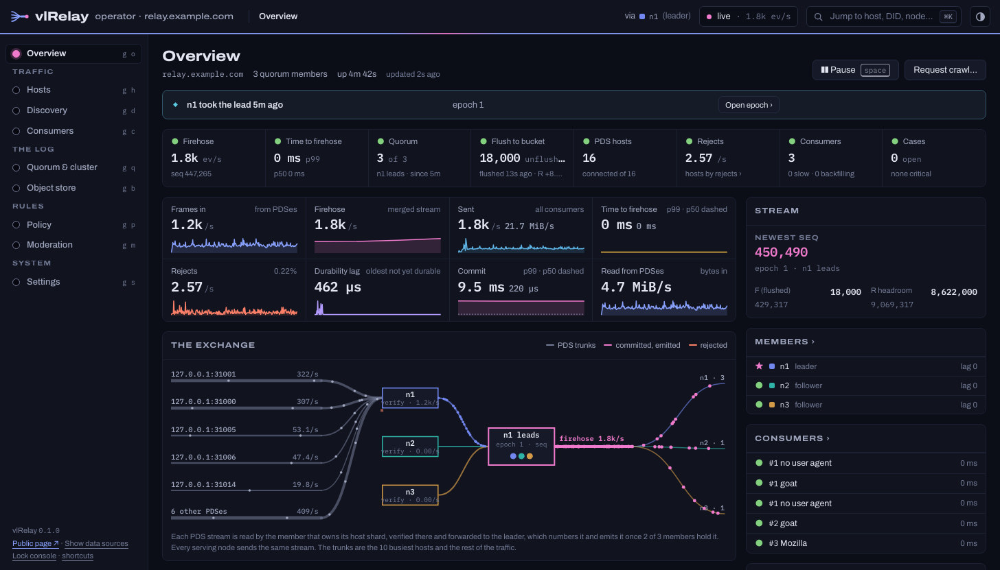
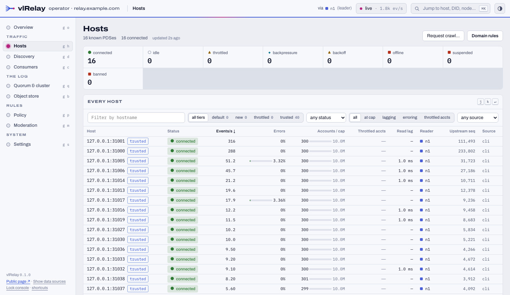
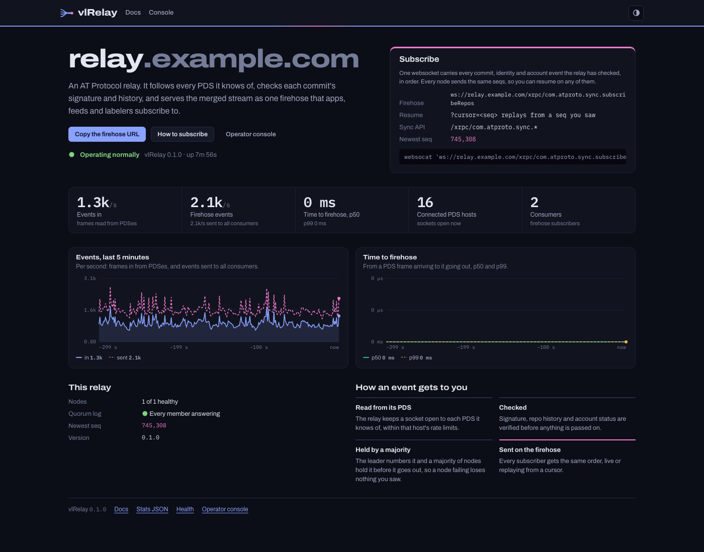
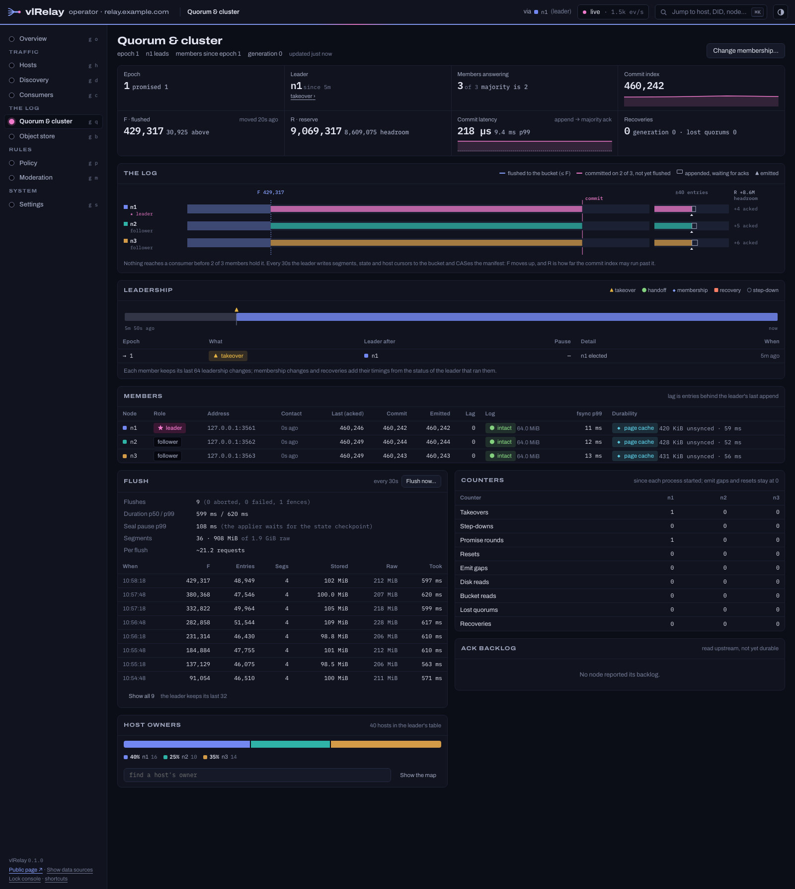

# vlRelay

vlRelay is an atproto relay on a replicated log. It subscribes to PDSes, checks every event
against sync 1.1, and serves one combined firehose from one node or three, with an S3, R2, GCS or
MinIO bucket as its long-term copy.



It's built from the parts of [vlpds](https://github.com/jazware/vlpds) that worked, now crates both
build on, [vlsync](https://github.com/jazware/vlsync) and [vlatproto](https://github.com/jazware/vlatproto):
its log segments, firehose serving and SlateDB state, and its atproto code. Consumers see a normal relay. indigo's Go consumers,
`goat` and Jetstream read it unchanged.

## Highlights

- Every node is a member of one quorum log. Each node reads the PDSes the leader's host table
  gives it and verifies their events. The leader checks each event against the account's record,
  gives it the next seq and replicates it, and every node emits it once two of the three hold it
  on disk. So a consumer can resume on any node with its cursor, and a takeover never takes back
  an event a consumer saw. → [Cluster](docs/cluster.md), [The quorum log](docs/quorum.md)
- A dead leader is replaced in ~50-120 ms (kill -9), or ~1 s when it hangs or is cut off. A dead
  member's PDSes move to the others after 2 s and resume from their cursors, which ride in the log.
- The bucket is written in bulk. Every 30 s the leader flushes the log as 64 MiB segments, the
  accounts' records, the host table and the PDS cursors, with one manifest written last. That's
  about 0.5 writes and 1.7 reads a second at today's load. If two nodes lose their disks, the log
  resumes from the last flush and the PDSes resend the rest. → [Design](docs/design.md)
- One node is the same log with one member, its commitlog the write-ahead log. Going to three is a
  membership change (`qlog member` or the dashboard), with no migration.
- Every event is checked. vlRelay verifies commit signatures, the MST inversion against
  `prevData`, rev order and host authority, and keeps per-account chain state. Signature
  verification is ~33 µs of CPU per event, so one core checks ~30k events/s.
- The quorum log commits 200k events/s on three nodes with their commitlogs on tmpfs (measured),
  and at today's ~350 events/s three small VPSes and R2 come to ~$18 a month (modeled).
  → [Performance](docs/perf.md), [Cost](docs/cost.md)
- A cold relay finds its hosts. The leader reads other relays' `listHosts` (`--bootstrap-relay`)
  and, with `--plc-export`, the PDSes the PLC directory's export names. Each goes through the
  relay's own admission checks, and it never asks another relay to crawl anything. The export also
  seeds every DID document, so a cold start doesn't resolve each account on its own.
  → [Policy](docs/policy.md#discovering-hosts)
- Policy is data in the bucket. Host tiers, per-host and per-account limits, domain rules,
  requestCrawl admission, cluster-wide budgets, auto-throttling and spam counters that open cases
  are one versioned document that every node reloads. The defaults follow indigo's relay wherever it
  has a number. → [Policy](docs/policy.md)
- A public page at `/` shows safe aggregates (events/s, time to firehose, hosts, consumers, node
  and quorum health) and how to subscribe, from an allow-listed `/api/public/stats`. The operator
  console at `/admin` shows live rates, rejects, hosts, consumers, cases, the cluster, the quorum
  log and the effective config. It also edits the policy and domain rules, throttles or bans
  hosts, and takes down accounts. → [Admin API](docs/admin-api.md)
- It's compatible with what reads Bluesky's relay today. indigo's consumer, the sync 1.1 checks,
  `goat`, `@atproto/sync`, Jetstream and the sync API matched indigo's relay event for event on the
  same upstreams, and the seqs are dense (1, 2, 3, …) and the same on every node.
  → [Compatibility](docs/compat.md), [Subscribe to the firehose](docs/subscribing.md)

The screenshots here come from a local three-node cluster (a leader and two followers) reading a
`fakepds` fleet of 40 fake PDSes with ~12,000 fake accounts and its own PLC, at ~1.5k events/s.
[Load fleet](docs/loadfleet.md) shows how to run one. Two of the hosts send a few bad signatures
on purpose, so there are rejects. The hosts page, busiest first:



The public page on the same cluster:



The console's quorum and cluster page, with each member's acked, committed and emitted seq, the
flush point F and reserve R, leadership changes, bucket recoveries and which member reads each
host:



## Quickstart

The quickest way to try it is the published image. This runs one node in memory, subscribed to
one PDS:

```sh
docker run --rm -p 2980:2980 ghcr.io/jazware/vlrelay \
  --memory --host morel.us-east.host.bsky.network --admin-token dev
```

`morel.us-east.host.bsky.network` is one of Bluesky's PDSes, and any PDS hostname works. The
firehose is `ws://127.0.0.1:2980/xrpc/com.atproto.sync.subscribeRepos`, the dashboard is
<http://127.0.0.1:2980/admin> (user `admin`, password `dev`) and the docs are at
<http://127.0.0.1:2980/docs>.

The `main` tag follows the main branch, `sha-<commit>` (the first 7 characters) pins one build of
it, and releases get semver tags.

To build from source, with Rust, Node and [just](https://github.com/casey/just) installed:

```sh
git clone https://github.com/jazware/vlrelay && cd vlrelay
docker build -t vlrelay:local .              # the same image, built locally
```

or without Docker:

```sh
cargo build --release                        # target/release/vlrelay (pulls vlsync and vlatproto from git)
cd ui && npm ci && npm run build && cd ..    # the dashboard and docs, served from ui/dist
target/release/vlrelay --memory --host morel.us-east.host.bsky.network --admin-token dev
```

`--memory` keeps nothing. [`deploy/single`](deploy/single/docker-compose.yml) runs a node on a
local MinIO:

```sh
cd deploy/single
UPSTREAM=morel.us-east.host.bsky.network VLRELAY_ADMIN_TOKEN=$(openssl rand -hex 16) \
  docker compose up -d --build
```

For three nodes, [Cluster](docs/cluster.md#running-one) has the bucket, the peer network and the
flags, and [Deploy](docs/operations/deploy.md) covers the proxy in front and upgrades.

To work on it, `just dev-up` starts a local network (MinIO, PLC, the reference PDS and two vlpds
upstreams), `just dev-seed` and `just dev-load` put accounts and traffic on it, and `just relay`
runs the relay against it. [Development](docs/devloop.md) has the rest.

## Documentation

The docs live in [`docs/`](docs), and every node serves them at `/docs` with no auth.

| Start here | Run it | How it works | Reference |
|---|---|---|---|
| [Overview](docs/overview.md) | [Operations](docs/operations/index.md) | [Design](docs/design.md) | [Admin API](docs/admin-api.md) |
| [Subscribe to the firehose](docs/subscribing.md) | [Deploy](docs/operations/deploy.md) | [The quorum log](docs/quorum.md) | [Compatibility](docs/compat.md) |
| | [Configuration](docs/operations/configuration.md) | [Cluster](docs/cluster.md) | [Performance](docs/perf.md) |
| | [Monitoring](docs/operations/monitoring.md) | [Policy](docs/policy.md) | [Cost](docs/cost.md) |
| | | [Policy internals](docs/policy-internals.md) | [Reference notes](docs/reference-notes.md) |
| | | | [Quorum log measurements](docs/quorum-measurements.md) |

Testing has its own pages: [Development](docs/devloop.md) (building, the local network, the e2e
suite), the [load fleet](docs/loadfleet.md) behind the perf numbers, [chaos runs](docs/chaos.md)
and the [shadow run](docs/shadow.md) against real PDSes.

## Status

vlRelay is new and hasn't run in production. It has unit and differential tests against a second
atproto implementation, an e2e suite on a local network (one node under kill -9, policy faults),
chaos runs of the relay on the quorum log (one node and three, under kill -9, partitions, pauses,
power cuts, wiped disks and membership changes, every node's stream checked, `just relay-chaos`)
and the compat harness against indigo's tools. The docs list what's not built yet in each area.

## Contributing

Issues and pull requests are welcome. Before sending a change, run the unit tests and, if you
touched the docs, the docs check:

```sh
cargo test --lib
cd ui && npm ci && npm run check-docs
```

[docs/_style.md](docs/_style.md) says how the docs are written and built.

## License

[MIT](LICENSE)
